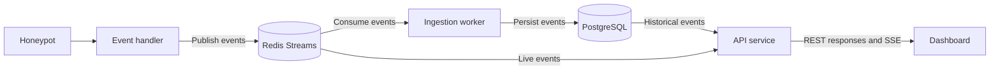

# Panopticon

Panopticon captures interactions with simulated SSH service, stores them as structured events and lets an operator inspect live and historical activity.

## Proposed Architecture

### Services
| Service          | Purpose                                                                                                      |
|------------------|--------------------------------------------------------------------------------------------------------------|
| Controller       | Start and stop configured honeypots and reconcile their desired and actual states.                           |
| Ingestion worker | Consume events, validate them, persist them, and acknowledge successful processing; recover unfinished work. |
| API              | Provide filtered historical queries and stream live events to dashboard clients.                             |
| Frontend         | Display events, filters, and connection status.                                                              |
| SSH Honeypot     | Simulate SSH interactions and produce connection, authentication, and command events.                        |

## API
### Endpoints
`GET /events` -- Shows a list of events in a newest-first order

| Parameter  | Type      | Proposed Behaviour                                           |
| ---------- | --------- | ------------------------------------------------------------ |
| limit      | int       | Default `50`, minimum `1`, maximum `500`.                    |
| event_type | EventType | One of the supported event types. Invalid values return 422. |
| src_ip     | string    | Exact IPv4 address match.                                    |
| src_port   | int       | Exact source-port match, from `0` to `65535`.                |
| session_id | string    | Exact session ID match.                                      |
| start_time | datetime  | Include events at or after this timestamp                    |
| end_time   | datetime  | Include events before this timestamp.                        |

`GET /events/stream` -- Live events stream using Server-Sent Events.

## Reliability

- Events retain the same event ID across retried.
- The ingestion worker only acknowledges after a successful PostgreSQL commit.
- Reprocessing an existing event ID does not create another stored event.
- Unacknowledged messages are recoverable after a worker restart.
- Invalid events are preserved with a failure reason for investigation.

## Stack

**Backend:**
- Psycopg3 (PostgreSQL with SQLAlchemy abstraction)
- Pydantic for type checking and serialisation
- Asynchronous I/O as there will be several concurrent users making DB and log file writes.
- AsyncSSH for an asynchronous SSH server
- Redis for event integrity and recovery