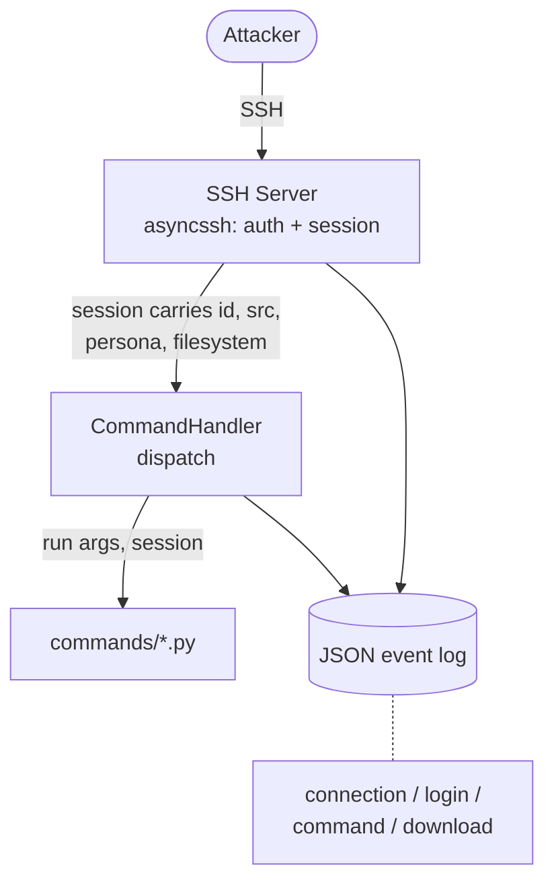

# Panopticon

An extensible SSH honeypot that presents attackers with a convincing fake Linux
server, logs everything they do, and captures the credentials and payload URLs
they reveal, all without ever executing their input or touching a real system.

Panopticon is built around **configurable machine personas**: the entire
fictional host (its identity, accounts, and filesystem) is defined in a single
config file, so you can stand up a new decoy machine by editing YAML rather than
writing code.

> **Safety first:** A honeypot deliberately invites hostile traffic. Read the
> [Safety and Deployment](#safety-and-deployment) section before exposing this
> to any network. Attacker input is always treated as data to log and simulate.
> It is never executed against a real system.

---

## Why Panopticon

Most SSH honeypots either capture too little to be useful or are painful to
configure and extend. Panopticon aims for a different balance:

- **Personas are data, not code.** One YAML file defines the whole fake machine.
  Swapping distros, hostnames, or accounts means editing config, not source.
- **Convincing by construction.** Every command reads from one shared source of
  truth (the persona), so the machine's story stays internally consistent and
  resists fingerprinting.
- **Built to be extended.** Commands are self-contained modules dropped into a
  folder. Adding one is copy a template, fill it in, done.
- **Intelligence-focused logging.** Structured JSON events capture the full
  attacker session: connection, credentials, every command, and any payload
  URLs from `wget`/`curl`.

---

## What it does

- Presents an interactive SSH shell backed by a **fake in-memory filesystem**
  that attackers can navigate (`cd`, `ls`, `cat`, `pwd`).
- Accepts configurable accounts (including passwordless logins) and **captures
  every login attempt**, successful or not. The failed attempts are the
  credential-spraying intelligence.
- Emulates common recon and utility commands (`whoami`, `id`, `uname`,
  `hostname`, `ps`, `clear`, `help`, `man`, and more).
- **Captures download URLs** from `wget` and `curl`, the single most valuable
  artifact a honeypot produces since it points at the attacker's malware, and
  simulates a successful download so the attacker keeps going.
- Writes **structured JSON logs** (one event per line) of the whole session
  lifecycle, designed for querying rather than reading.

---

## How it works



- **Persona profile** (`config.yaml`) defines the fictional machine. It is loaded
  and validated once at startup; a malformed profile fails loudly rather than
  serving a subtly-wrong machine.
- **Fake filesystem** is authored as real files under `filesystem/<persona>/`,
  loaded into an in-memory tree at startup, and wrapped in a `FakeFS` interface.
  Each session gets its own copy, so one attacker's changes never leak into
  another's view. The running honeypot never reads real disk in response to
  attacker input.
- **Commands** are modules in `commands/`. Each exposes a `run(args, session)`
  function and is auto-discovered at startup, with no central registry to edit.

---

## Getting started

### Requirements

- Python 3.10+
- `asyncssh`
- `pyyaml`

```bash
pip install asyncssh pyyaml
```

### Generate a host key

The server needs an SSH host key. Generate one (empty passphrase, since the
server loads it unattended):

```bash
mkdir -p keys
ssh-keygen -t ed25519 -f keys/ssh_host_key -N ""
```

### Run it

```bash
python src/server.py --port 2222 --profile config.yaml
```

Then connect from another terminal:

```bash
ssh guest@localhost -p 2222
```

### Command-line options

| Flag            | Default                | Description                        |
|-----------------|------------------------|------------------------------------|
| `--host`        | `0.0.0.0`              | Address to bind                    |
| `--port`        | `2222`                 | Port to listen on                  |
| `--host-key`    | `keys/ssh_host_key`    | Path to the SSH host key           |
| `--profile`     | `config.yaml`          | Path to the persona profile        |

---

## Configuring a persona

A persona is one YAML file describing the whole fictional machine. To create a
new one, copy the example and edit it. No code changes required.

```yaml
profile_name: ubuntu-web

host:
  hostname: web-01
  kernel_name: Linux
  kernel_release: 5.15.0-91-generic
  kernel_version: "#101-Ubuntu SMP Tue Nov 14 18:35:29 UTC 2023"
  machine: x86_64
  os: GNU/Linux

os_release:
  pretty_name: "Ubuntu 22.04.3 LTS"
  name: Ubuntu
  version_id: "22.04"
  id: ubuntu

accounts:
  - username: guest
    password: ""        # empty password = passwordless login
    uid: 1001
  - username: admin
    password: admin
    uid: 1000

filesystem:
  root: filesystem/ubuntu-web

banner: |
  Welcome to Ubuntu 22.04.3 LTS (GNU/Linux 5.15.0-91-generic x86_64)
```

**Consistency is what keeps a persona convincing.** The values here must agree
with each other and with the fake filesystem: `os_release` should match
`filesystem/<persona>/etc/os-release`, the accounts should match
`etc/passwd`, and the kernel/arch should match what `uname` reports. An attacker
who cross-checks these is exactly who a mismatch will tip off.

---

## Logging

Every event is a single line of JSON, suitable for `jq`, ingestion into a SIEM,
or direct analysis. Event types include:

- `connection_open` / `connection_close`, with source IP, port, and duration
- `login_attempt`, with username, password, and whether it succeeded
- `command`, the raw command string, verbatim
- `download_attempt`, the URL passed to `wget`/`curl`

Example query, the most-tried passwords across all sessions:

```bash
jq -r 'select(.event=="login_attempt") | .password' panopticon.log \
  | sort | uniq -c | sort -rn
```

---

## Safety and deployment

A honeypot's entire purpose is to attract attackers, so it must be deployed such
that a compromise of the honeypot can never become a compromise of anything else.

**Core invariant:** Attacker input is data. It is logged and responded to with
simulated output. It is **never** executed, never used to read real files, and
never used to fetch remote content. `wget`/`curl` capture and log URLs; they do
not download anything.

**Before exposing Panopticon to real traffic:**

- Run it in an **isolated VM or container** on a **segmented network**.
- **Lock down outbound (egress) traffic** so the box cannot reach anything you
  care about even if something goes wrong.
- Do **not** run it as root or alongside anything sensitive.
- To catch real attackers who target port 22, use a **firewall redirect** from
  22 to the honeypot's port rather than exposing the honeypot port directly.
- Treat the **log file as sensitive**. It contains captured credentials and live
  malware URLs. Restrict its permissions and consider shipping logs off-host.

---

## Extending Panopticon

Adding a command is intentionally simple. Create a file in `commands/`:

```python
"""whoami - print the effective username."""

NAME = "whoami"                      # the command name (optional; defaults to filename)
MAN = "whoami - print effective user name"   # optional man-page text

def run(args, session):
    # args:    list of arguments after the command name
    # session: shared state (username, cwd, fs, persona profile, ...)
    # return:  the string to print (the dispatcher handles newlines)
    return session.get("username", "guest")
```

That's the whole contract. The command is auto-discovered at startup.

**The one rule that cannot be broken:** a command may only read state and return
strings. It must never execute attacker input, run shell commands, read the real
filesystem, or make network requests. This is what keeps Panopticon a decoy
rather than a foothold.

See `CONTRIBUTING.md` for the full contract, testing guidance, and coding style.

---

## Roadmap

Planned, not yet implemented:

- Splunk app with prebuilt dashboards and detections (CIM-aligned fields, HEC
  streaming)
- Write commands for the fake filesystem (`touch`, `mkdir`, `rm`)
- Additional personas (other distros, kernel versions, server roles)
- Tab completion for a more convincing interactive session
- Pipe and redirection support (`ps aux | grep`, `echo > file`)
- Test suite and CI

---

## License

Panopticon is released under the [MIT License](LICENSE). You are free to use,
copy, modify, merge, publish, distribute, sublicense, and sell copies of it. The
only condition is that the copyright notice and permission notice are included in
copies or substantial portions of the software.

---

## Disclaimer

Panopticon is a defensive security research tool intended for use on
infrastructure you own or are authorised to operate. You are responsible for
deploying it lawfully and safely.