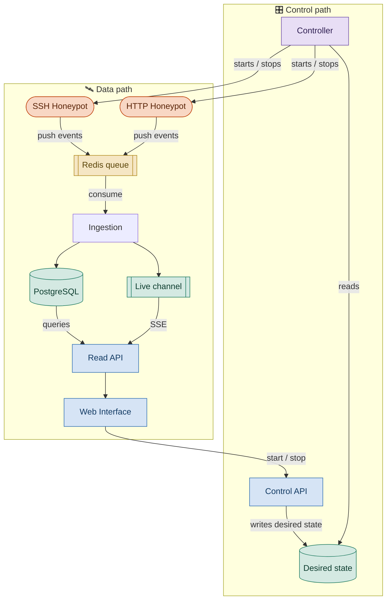

# Panopticon
Panopticon is a dashboard-first modular honeypot. Currently supports the following protocols:

- SSH
- HTTP

## Technologies used in this project
**Backend**
- Python
- FastAPI
- Redis
- PostgreSQL

**Frontend**
- TypeScript
- React

## Get Started
Will be implementing Docker multi-container architecture soon.

## Project Architecture
Panopticon has three main functions: running honeypots, collecting their data, and controlling them.

Each honeypot emits structured events. These are ingested, validated, and enriched (geo-IP, attack tagging), then written to a PostgreSQL database in batches for efficient storage. The FastAPI backend queries Postgres to serve the dashboard in the React web interface.

Alongside being stored, events are also streamed to a console in the web interface using Server-Sent Events (SSE), showing attack activity in real time.

The web interface lets users start, stop, and configure honeypots. Rather than controlling them directly, it records the desired state, and a controller reconciles the running honeypots to match it. This is a deliberate design choice: keeping process control out of the internet-facing web interface reduces the attack surface.

### Visual Representation

```mermaid
flowchart TD
    subgraph data["🛰️ Data path"]
        direction TB
        SSH([SSH Honeypot]) -->|push events| REDIS[[Redis queue]]
        HTTP([HTTP Honeypot]) -->|push events| REDIS
        REDIS -->|consume| ING[Ingestion]
        ING --> PG[(PostgreSQL)]
        ING --> LIVE[[Live channel]]
        PG -->|queries| API[Read API]
        LIVE -->|SSE| API
        API --> FE[Web Interface]
    end

    subgraph control["🎛️ Control path"]
        direction TB
        FE -->|start / stop| CAPI[Control API]
        CAPI -->|writes desired state| DS[(Desired state)]
        CTRL[Controller] -->|reads| DS
        CTRL -->|starts / stops| SSH
        CTRL -->|starts / stops| HTTP
    end

    classDef sensor fill:#f8d7c4,stroke:#c1440e,color:#5a2408;
    classDef queue fill:#f5e6c4,stroke:#b0891d,color:#5a4408;
    classDef store fill:#d4e9e2,stroke:#1d7a5f,color:#0d3d2f;
    classDef api fill:#d6e4f5,stroke:#2c6cb0,color:#123a63;
    classDef control fill:#e8def5,stroke:#6b4ba8,color:#2f1f52;

    class SSH,HTTP sensor;
    class REDIS queue;
    class PG,DS,LIVE store;
    class API,CAPI,FE api;
    class CTRL control;
```