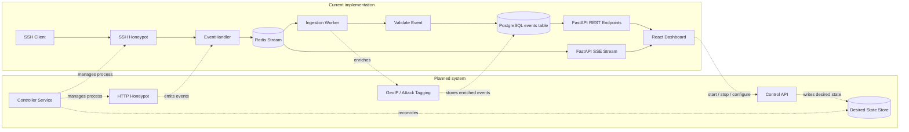

# Panopticon

Panopticon is an in-progress honeypot telemetry platform. The current implementation focuses on an SSH honeypot which captures attacker activity as structured events, publishes those events to Redis Streams, ingests them into PostgreSQL, and exposes them through a FastAPI API for a React dashboard.

The long-term goal is a modular, controller-driven honeypot system with multiple protocol honeypots, live threat visualisation, GeoIP enrichment, and a production-style deployment story.

## Current Status

### Implemented

- SSH honeypot built with `asyncssh`
- Per-connection SSH session context
- Password authentication capture
- Basic interactive shell prompt
- Command handling through a module registry
- `wget` command module which emits a `file_download` event
- Structured Pydantic event models
- Redis Streams event publishing
- Background event publishing from async SSH callbacks
- Redis stream reader for ingestion and live API streaming
- PostgreSQL event persistence
- Duplicate-safe inserts using `ON CONFLICT DO NOTHING`
- FastAPI API with event list, event count, event lookup, and SSE stream endpoints
- CORS configured for the local Vite frontend
- React/Vite/TypeScript frontend scaffold
- React Router app shell with sidebar navigation
- Initial dashboard layout and first metric panel
- Central internal logger writing to file and stdout
- Environment-based settings with `pydantic-settings`

### In Progress

- Dashboard cards for recent events, active sessions, top sources, commands, and file activity
- Frontend API client and custom hooks layer
- More realistic SSH command modules
- Better shell realism and fake Linux filesystem
- API route organisation
- PostgreSQL schema/migration workflow

### Planned

- HTTP honeypot
- Controller service for starting/stopping honeypots
- Desired-state model for controlled honeypot lifecycle management
- GeoIP enrichment
- Attack classification/tagging
- Server-side dashboard metrics endpoints
- WebSocket or SSE fan-out strategy for multiple frontend clients
- Docker Compose for Redis, PostgreSQL, API, ingestor, honeypots, and frontend
- Tests for event models, Redis publishing, ingestion, database storage, API endpoints, and SSH command handling
- CI checks for formatting, typing, linting, and tests

## Architecture

The current system is event-driven. Honeypots do not write directly to PostgreSQL. Instead, they emit structured events to Redis Streams. A separate ingestion worker reads the stream, validates events, and persists them to PostgreSQL. FastAPI exposes stored events over REST and streams live events to the frontend through Server-Sent Events.


```mermaid
flowchart LR
    subgraph current["Current implementation"]
        attacker[SSH Client] --> ssh[SSH Honeypot]
        ssh --> handler[EventHandler]
        handler --> redis[(Redis Stream)]

        redis --> ingestor[Ingestion Worker]
        ingestor --> validate[Validate Event]
        validate --> postgres[(PostgreSQL events table)]

        postgres --> rest[FastAPI REST Endpoints]
        redis --> sse[FastAPI SSE Stream]

        rest --> frontend[React Dashboard]
        sse --> frontend
    end

    subgraph planned["Planned system"]
        http[HTTP Honeypot] -. emits events .-> handler
        ingestor -. enriches .-> geo[GeoIP / Attack Tagging]
        geo -. stores enriched events .-> postgres

        frontend -. start / stop / configure .-> control_api[Control API]
        control_api -. writes desired state .-> desired[(Desired State Store)]
        controller[Controller Service] -. reconciles .-> desired
        controller -. manages process .-> ssh
        controller -. manages process .-> http
    end
```

## Event Flow

1. A client connects to the SSH honeypot.
2. The SSH server creates an `SSHSessionContext` for that connection.
3. Connection, login, command, and file download events are represented as Pydantic models.
4. `EventHandler` publishes each event to Redis Streams.
5. `IngestionWorker` reads batches from Redis.
6. The worker validates each raw event JSON string.
7. Valid events are inserted into PostgreSQL.
8. FastAPI reads stored events from PostgreSQL for REST endpoints.
9. FastAPI also streams live Redis events to the React frontend using SSE.

## Project Structure

```text
backend/
  panopticon/
    adapters/
      postgres.py          PostgreSQL connection and event persistence
      redis.py             Redis Stream append/read helpers
    api/
      main.py              FastAPI application and routes
    config/
      constants.py         Shared constants and module names
      settings.py          Environment-driven application settings
    events/
      event_handler.py     Event publishing abstraction
      models.py            Pydantic event models
    honeypots/
      ssh/
        server.py          AsyncSSH server implementation
        shell.py           Interactive shell session
        context.py         SSH session and command context objects
        command_handler.py Command registry and command dispatch
        commands/
          wget.py          Example command module
    ingestion/
      worker.py            Redis-to-PostgreSQL ingestion loop
    observability/
      logging.py           Internal application logger

frontend/
  src/
    components/
      layout/              App shell and sidebar
      ui/                  Reusable UI components
    pages/                 Route-level pages
    styles/                SCSS reset, variables, and layout
    data/                  Shared frontend types
```

## Current API

```text
GET /events/
```

Returns recent events from PostgreSQL. Supports a `limit` query parameter.

```text
GET /events/number
```

Returns the total number of stored events.

```text
GET /events/stream
```

Streams live events from Redis using Server-Sent Events.

```text
GET /events/{event_id}
```

Returns a single event by UUID.

## Event Types

Current event models:

- `connection_open`
- `connection_closed`
- `login_attempt`
- `command`
- `file_download`

All events share:

- `id`
- `timestamp`
- `session_id`
- `src_ip`
- `src_port`
- `event_type`

Specialised events add fields such as `username`, `password`, `success`, `input`, `tool`, `url`, and `destination`.

## Local Development

This project is still being formalised, so setup is currently manual.

### Backend

From `backend/`:

```powershell
python -m venv .venv
.\.venv\Scripts\Activate.ps1
pip install asyncssh redis psycopg pydantic pydantic-settings fastapi uvicorn
```

Run the SSH honeypot:

```powershell
python -m panopticon.honeypots.ssh.server
```

Run the ingestion worker:

```powershell
python -m panopticon.ingestion.worker
```

Run the API:

```powershell
uvicorn panopticon.api.main:app --reload --host 127.0.0.1 --port 8000
```

### Frontend

From `frontend/`:

```powershell
npm install
npm run dev
```

The frontend expects the API at:

```text
http://127.0.0.1:8000
```

## Configuration

Settings are loaded with `pydantic-settings`. The app currently supports nested environment variables using `__` as the delimiter.

Example future `.env` shape:

```env
ENVIRONMENT=dev
REDIS__HOST=127.0.0.1
REDIS__PORT=6379
REDIS__STREAM_NAME=panopticon.events
DATABASE__USER=panopticon
DATABASE__PASSWORD=testpass
DATABASE__HOST=localhost
DATABASE__PORT=5432
DATABASE__NAME=panopticon
SSH__HOST=127.0.0.1
SSH__PORT=2222
```

## Why Redis Streams?

Redis Streams are used as a lightweight event broker between honeypots and ingestion. This keeps the honeypot process focused on capturing behaviour and publishing events quickly, while persistence and future enrichment happen in a separate worker.

This also makes it easier to add more honeypots later. New honeypots should emit the same event model shape and publish to the same stream.

## Design Direction

Panopticon is intended to become a dashboard-first security application. The frontend is currently a basic React layout, but the planned interface includes:

- Live event console
- Attack map
- Active sessions
- Event timeline
- Top source IPs
- Top commands
- File download/upload activity
- Honeypot status and controls

## Security Notice

This project is for local development and educational use. Do not expose the honeypot publicly without proper isolation, firewalling, monitoring, legal review, and secret handling. Honeypots may capture credentials and attacker payloads, so logs and databases should be treated as sensitive.

## Roadmap

### Phase 1: SSH Telemetry Foundation

- SSH honeypot
- Event models
- Redis publishing
- PostgreSQL ingestion
- FastAPI access layer
- Basic React dashboard layout

### Phase 2: Dashboard and API Maturity

- Dedicated API route modules
- Frontend API client layer
- Custom hooks for metrics and event streams
- Dashboard cards backed by API data
- SSE-powered recent events panel
- Improved error/loading states

### Phase 3: Realistic Honeypot Behaviour

- Expanded SSH command modules
- Fake filesystem
- More realistic shell responses
- File download and upload tracking
- Privilege escalation attempt detection

### Phase 4: Controller and Multi-Honeypot Support

- Desired-state store
- Controller process
- Start/stop/restart honeypots
- HTTP honeypot
- Health checks and status reporting

### Phase 5: Production Readiness

- Docker Compose
- Database migrations
- Test suite
- CI pipeline
- Structured logging improvements
- Configuration hardening
